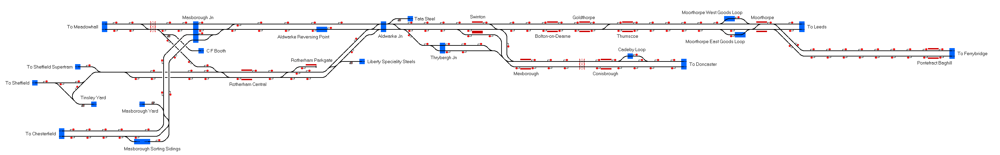

# Rotherham and Dearne Valley
A small route covering the railways from Rotherham to Moorthorpe, Pontefract and Conisborough.

## Current Status

| Stage         | Status        |
| ------------- |:-------------:|
| Track Plan     |  |
| Signalling      |       |
| Naming |       |
| Speed Limits |  |
| Distances |  |
| Timetable |  |
| Documentation |  |

## Data Sources

- [TRAKSY.UK](https://traksy.uk/live/M+38+ROTHCEN)

Status icons by Freepik, pixelmeetup, Pixel Perfect on FlatIcon.com.
